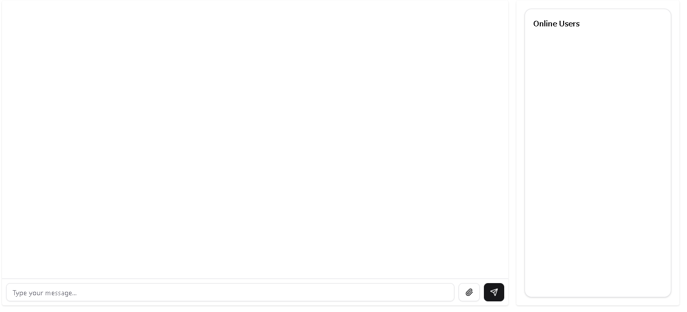

#  Real-Time Chat Application

A modern full-stack chat application with real-time messaging, file/image upload, typing indicators, private messaging, read receipts, and message reactions — built with **React**, **Socket.io**, **Node.js**, and **MongoDB**.

---

## 🔧 Tech Stack

### Frontend
- React (Vite)
- Tailwind CSS + ShadCN UI
- Axios
- Socket.io Client
- JWT for authentication

### Backend
- Node.js + Express
- MongoDB + Mongoose
- Socket.io Server
- Multer (for file uploads)
- JWT Auth middleware

---

##  Features

- ✅ Real-time chat (global + private)
- ✅ Typing indicators
- ✅ Online users list
- ✅ JWT-based authentication
- ✅ File & image upload (with preview)
- ✅ Read receipts
- ✅ Message reactions 
- ✅ Clean and responsive UI


## Project Structure

```

├── client/                 # React front-end
│   ├── public/             # Static files
│   ├── src/                # React source code
│   │   ├── components/     # UI components
│   │   ├── context/        # React context providers
│   │   ├── hooks/          # Custom React hooks
│   │   ├── pages/          # Page components
│   │   ├── socket/         # Socket.io client setup
│   │   └── App.jsx         # Main application component
│   └── package.json        # Client dependencies
├── server/                 # Node.js back-end
│   ├── config/             # Configuration files
│   ├── controllers/        # Socket event handlers
│   ├── models/             # Data models
│   ├── socket/             # Socket.io server setup
│   ├── utils/              # Utility functions
│   ├── server.js           # Main server file
│   └── package.json        # Server dependencies
└── README.md               # Project 

```


## Setup Instructions

### 1. Clone the Repo
``bash
https://github.com/PLP-MERN-Stack-Development/week-5-web-sockets-assignment-KelvinMbugii.git


### 2. Install Dependencies
-- Backend
cd server
npm install

-- Frontend 
cd Client
npm install

### 3. Run the App
cd server
npm run dev


cd client
npm run dev

### 4. Authentication
JWT is used to protect socket connections.

Each user must log in or register to get a token.

Socket connection includes token in socket.auth.

### Screenshots



